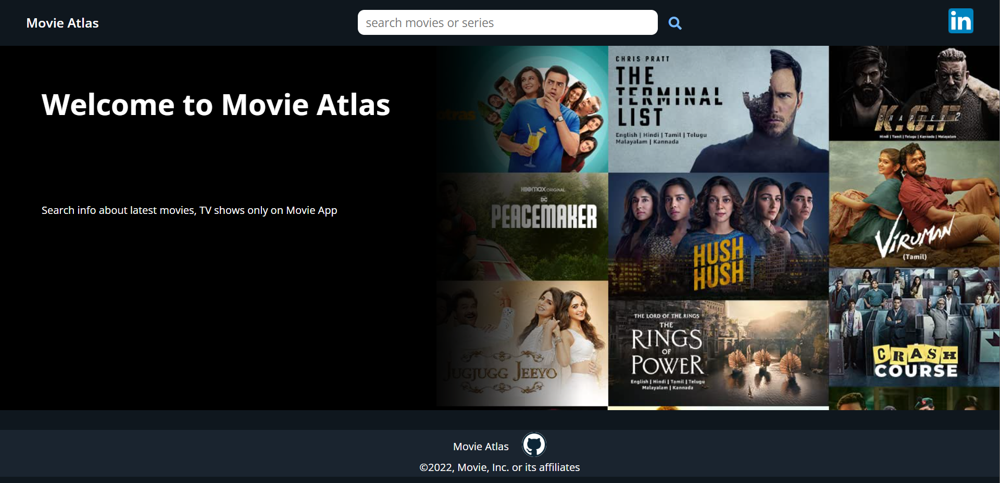
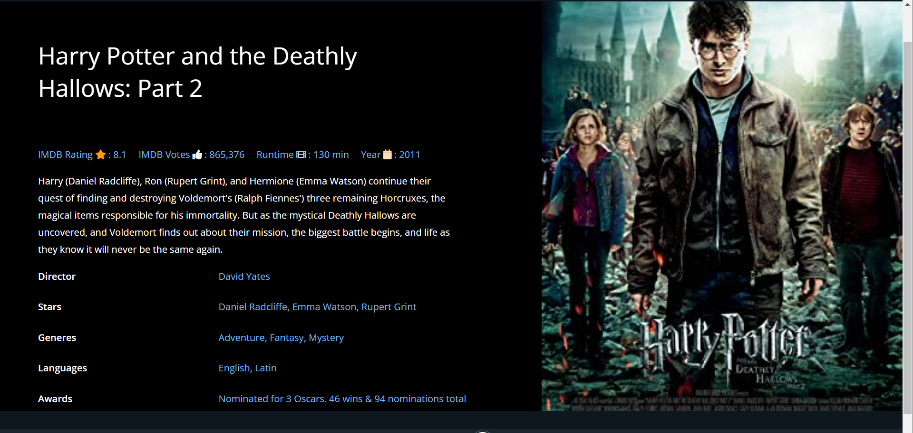

# Movie Atlas

Movie Atlas is a web application intended to serve users with movie or series details.

## Demo

Insert gif or link to demo

## Screenshots




## Run Locally

Clone the project

```bash
  git clone https://github.com/Rishabh-D/movie-atlas.git
```

Go to the project directory

```bash
  cd movie-app
```

Install dependencies

```bash
  npm install
```

Start the server

```bash
  npm run start
```

## API Reference

## Omdb Api is used to fetch movie/series details

##### base url : https://www.omdbapi.com/

#### Get all items

```http
  GET ?apiKey=${REACT_APP_API_KEY}&s=${tag}&type=movie
```

| Parameter | Type     | Description                   |
| :-------- | :------- | :---------------------------- |
| `apiKey`  | `string` | **Required**. Your API key    |
| `s`       | `string` | **Required**. movie name      |
| `type`    | `string` | **Required**. movie or series |

#### Get item

```http
  GET ??apiKey=${REACT_APP_API_KEY}&i=${id}&Plot=full
```

| Parameter | Type     | Description                          |
| :-------- | :------- | :----------------------------------- |
| `apiKey`  | `string` | **Required**.                        |
| `i`       | `string` | **Required**. id of the movie/series |
| `Plot`    | `string` | **Required**. full/short             |

## Environment Variables

To run this project, you will need to add the following environment variables to your .env file

`REACT_APP_API_KEY = "<insert your api key here>"

## Acknowledgements

- [Omdi Api](https:www.omdbapi.com)
- [Chris Blakely](https://www.freecodecamp.org/news/react-movie-app-tutorial/)
